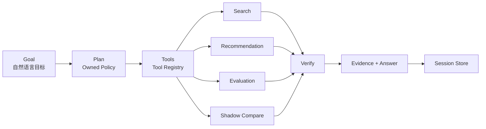

<div align="center">

# Recsys Harness

### Agentic infrastructure for search & recommendation

**把“调算法、跑脚本、看指标”变成可以直接交付给 Agent 的目标。**  
Plan · Execute · Evaluate · Verify · Improve

[](https://github.com/jiaweine/recsys-harness/actions/workflows/ci.yml)


</div>

---

**Recsys Harness** 是一个面向搜索与推荐系统的垂直 **Agent Harness**。

它不是“聊天机器人 + 指标看板”，也不是只返回一个 ranked list 的算法 Demo。用户只需要描述业务目标，Harness 会把目标转换成实际执行计划，调用项目自有的搜索 / 推荐 / 评估能力，验证执行结果，并把**结论、证据与下一步动作**留在同一会话里。

> **Goal in. Evidence out.**  
> 核心搜索与推荐能力由项目自身实现；外部大模型不是运行系统的必要依赖。

## Why this exists

传统搜推工作流往往散落在查询脚本、离线评估、调参实验、日志排查和人工复盘之间。

Recsys Harness 把这些动作收敛成一个可执行循环：

```text
用户目标
  ↓
理解任务与约束
  ↓
形成执行计划
  ↓
调用真实工具
  ↓
运行搜索 / 推荐 / 离线评估 / 候选比较
  ↓
验证结果与风险
  ↓
输出有证据支持的结论
```

用户关注的是**“体验有没有问题、该不该调整、下一步做什么”**，而不是先学习内部算法术语。

---

## Agent loop



运行时遵循：

**Observe → Plan → Execute → Verify → Complete**

| Layer | Responsibility |
|---|---|
| **Owned Policy** | 识别搜索 / 推荐 / 双路径 / 全局体检，提取查询和用户，生成真实执行步骤 |
| **Tool Registry** | 管理工具契约、输入、风险级别与 handler |
| **Search Engine** | 执行项目自有搜索排序 |
| **Recommendation Engine** | 生成个性化推荐序列 |
| **Offline Evaluation** | 对当前体验做可重复的离线复核 |
| **Shadow Compare** | 在不修改当前策略的前提下比较候选方案 |
| **Verifier** | 拦截空结果、重复结果、异常输出和明显回退 |
| **Workspace Store** | 保存会话、消息与执行结果 |

---

## What you can ask it to do

直接描述目标即可，例如：

```text
最近搜索“露营灯”的结果不太准，
帮我复现问题并比较一个改进方案，但先不要上线。
```

Harness 会实际执行：

1. 检查当前数据是否足够支撑判断；
2. 复现“露营灯”的当前搜索结果；
3. 用已知查询样本做整体复核；
4. 运行一个隔离的候选方案；
5. 比较当前方案与候选方案；
6. 经过验证器检查后再形成结论；
7. 返回本次执行证据与下一步建议。

推荐场景同样可以直接描述：

```text
检查用户 u-lin 当前的推荐体验，
如果有明显改进空间就比较一个候选方案。
```

---

## Built-in capabilities

### Search

项目内置的搜索引擎组合了：

- 中英文多粒度文本处理；
- 字段感知的词项匹配；
- 项目自有的稳定哈希语义表征；
- 标题、质量、热度、新鲜度等信号；
- 一屏结果去同质化；
- 已标注查询的离线质量复核。

### Recommendation

推荐引擎组合了：

- 隐式反馈与时间衰减；
- 用户内容偏好画像；
- 用户历史形成的 item-item 共现关系；
- 类目兴趣；
- 质量、新鲜度、热度与新颖度；
- 稳定探索；
- 一屏结果多样性优化；
- 已看内容过滤。

### Harness

真正把它变成产品的不是单个排序公式，而是外层执行系统：

- 持续会话；
- Goal planning；
- Tool contracts；
- Runtime event trace；
- 工具风险分级；
- Shadow Compare；
- Result verification；
- Evidence-backed answer；
- 可继续追问的客户工作台。

---

## Safe by design

当前内置工具仅包含 **read** 与 **simulation** 两类风险级别。

候选方案不会直接覆盖当前搜索 / 推荐策略，而是先在相同数据上运行：

```text
Current
   │
   ├──────────────┐
   │              │
   ▼              ▼
Evaluate       Candidate
                  │
                  ▼
               Evaluate
                  │
                  ▼
            Safety Gate
                  │
          ┌───────┴────────┐
          ▼                ▼
      safe_to_try        reject
```

只有通过离线门槛的候选方案才会被标记为 `safe_to_try`。项目默认**没有自动上线工具**。

---

## Product UI

前端不是算法调参面板，而是一个面向业务目标的**搜索推荐体验工作台**。

客户界面只使用产品语言：

- 搜索体验
- 推荐体验
- 方案复核
- 全局体检
- 执行记录
- 判断依据
- 当前数据

内部算法名和评估细节留在工程层，避免把实现复杂度转嫁给用户。

---

## Quick start

### 1. Clone & install

```bash
git clone https://github.com/jiaweine/recsys-harness.git
cd recsys-harness

python -m venv .venv
source .venv/bin/activate

pip install -r requirements.txt
```

Windows PowerShell:

```powershell
.venv\Scripts\Activate.ps1
```

### 2. Start the workspace

```bash
make run
```

Open:

```text
http://127.0.0.1:8765
```

FastAPI development docs:

```text
http://127.0.0.1:8765/docs
```

### 3. Run a complete harness task from CLI

```bash
make demo
```

Or:

```bash
python -m lingjing_harness.cli '最近搜索“露营灯”的结果不准，帮我优化，但先不要上线'
```

---

## Docker

```bash
docker build -t recsys-harness .
docker run --rm -p 8765:8765 recsys-harness
```

Then open `http://127.0.0.1:8765`.

---

## Bring your own data

支持通过 API 或页面导入 UTF-8 JSON 数据。当前文件上传上限为 **8 MB**。

```json
{
  "items": [
    {
      "id": "p01",
      "title": "示例内容",
      "text": "内容描述",
      "categories": ["户外"],
      "popularity": 120,
      "quality": 0.92,
      "freshness": 0.83
    }
  ],
  "interactions": [
    {
      "user_id": "u01",
      "item_id": "p01",
      "event": "click",
      "timestamp": 12
    }
  ],
  "query_labels": [
    {
      "query": "露营灯",
      "relevant": ["p01"]
    }
  ]
}
```

完整数据契约见 [`docs/DATA_FORMAT.md`](docs/DATA_FORMAT.md)。

---

## API surface

| Method | Endpoint | Purpose |
|---|---|---|
| `GET` | `/api/status` | 查看运行状态与当前数据概况 |
| `GET` | `/api/conversations` | 获取会话列表 |
| `POST` | `/api/conversations` | 创建体验任务 |
| `GET` | `/api/conversations/{id}` | 获取单个任务 |
| `POST` | `/api/conversations/{id}/messages` | 提交目标并启动 Harness |
| `GET` | `/api/runs/{run_id}` | 获取执行进度、事件与结果 |
| `POST` | `/api/data/import` | 导入 JSON payload |
| `POST` | `/api/data/import-file` | 上传 JSON 数据文件 |

任务执行采用异步 run + polling 方式，前端可以持续展示执行阶段与证据。

---

## Repository map

```text
recsys-harness/
├── lingjing_harness/
│   ├── algorithms/
│   │   ├── search.py          # Search engine
│   │   ├── recommend.py       # Recommendation engine
│   │   ├── evaluation.py      # Offline evaluation
│   │   ├── experiment.py      # Shadow comparison
│   │   └── text.py            # Text representation
│   ├── runtime/
│   │   ├── policy.py          # Goal → execution plan
│   │   ├── tools.py           # Tool registry
│   │   ├── verifier.py        # Result verification
│   │   └── harness.py         # Agent execution loop
│   ├── api.py                 # FastAPI backend
│   ├── cli.py                 # CLI entry point
│   ├── domain.py              # Data contracts
│   ├── sample_data.py         # Runnable sample workspace
│   └── store.py               # SQLite session persistence
├── frontend/
│   ├── index.html             # Customer workspace
│   ├── app.css
│   └── app.js
├── tests/                     # Search / recommendation / runtime / API tests
├── docs/                      # Architecture, design, data and acceptance docs
├── scripts/
├── Dockerfile
├── Makefile
└── pyproject.toml
```

---

## Quality checks

```bash
make check
make test
```

覆盖：

- Python 全量编译；
- 前端 JavaScript 语法；
- 搜索关键查询结果；
- 推荐已看过滤与结果分散度；
- 搜索 / 推荐离线质量检查；
- Harness 路由与工具执行；
- 候选方案比较与安全门槛；
- 结果证据输出；
- SQLite 会话持久化；
- API 基础契约与错误数据拦截。

CI 配置位于 [`.github/workflows/ci.yml`](.github/workflows/ci.yml)。

---

## Design principles

1. **Business goals first** — 用户表达业务问题，不要求先懂算法。
2. **Execution over narration** — 没有真实执行过的动作，不写成“已验证”。
3. **Evidence over confidence** — 结论必须能回到本次执行结果。
4. **Simulation before mutation** — 候选方案先隔离比较，不直接改变当前策略。
5. **Owned ranking core** — 搜索与推荐核心策略掌握在项目自身。
6. **LLM optionality** — 未来可以增加语言模型增强交互，但不让它成为核心排序的单点依赖。
7. **One clean path** — 保持一套清晰、可运行、可扩展的主路径，不堆积重复实现。

---

## Documentation

| Document | Contents |
|---|---|
| [`ARCHITECTURE.md`](docs/ARCHITECTURE.md) | Harness、工具、搜推内核、验证器与 Shadow Compare |
| [`DESIGN.md`](docs/DESIGN.md) | 客户工作台设计系统与交互原则 |
| [`DATA_FORMAT.md`](docs/DATA_FORMAT.md) | 数据字段、导入格式与约束 |
| [`ACCEPTANCE.md`](docs/ACCEPTANCE.md) | 工程验收与检查标准 |

---

## Direction

Recsys Harness 的目标不是成为另一个“算法后台”。

它希望成为搜索与推荐系统上方的一层 **agentic operating layer**：

```text
发现问题
  → 复现问题
  → 运行评估
  → 运行 / 比较候选
  → 验证风险
  → 形成证据
  → 推动下一步实验
```

随着工具边界扩展，这一层可以继续接入更真实的数据源、实验平台、流量控制、人工审批和线上观测，而上层的 Agent Runtime 与工具契约保持稳定。

---

<div align="center">

**Search and recommendation are the capabilities.  
The harness is the product.**

</div>
