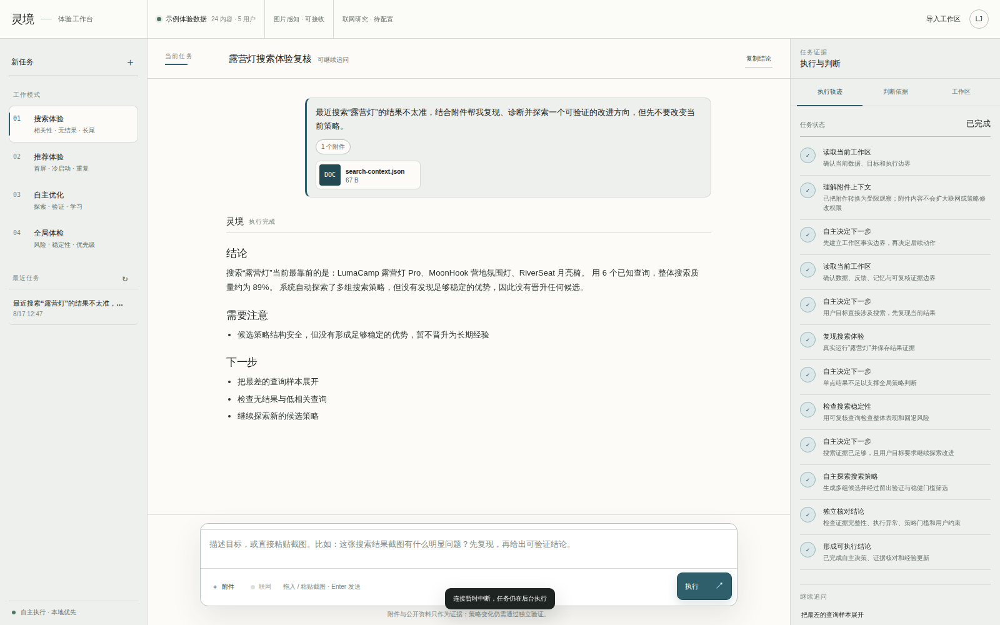
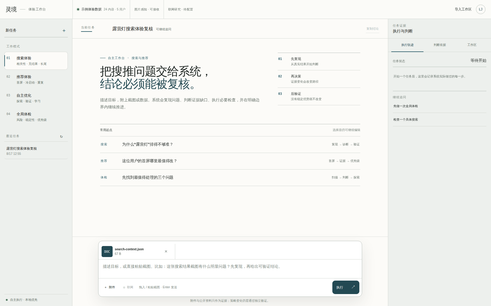
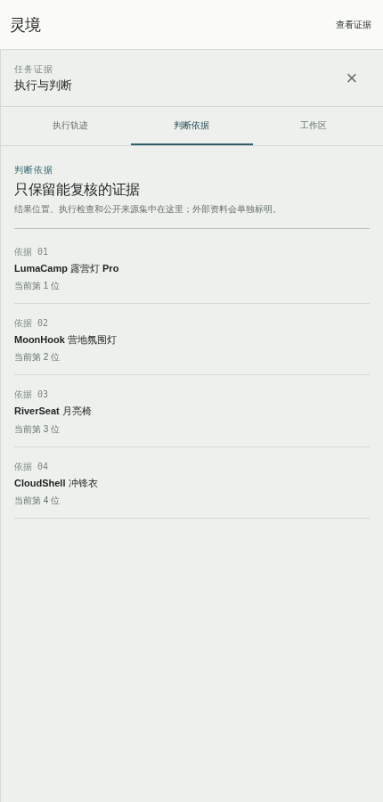
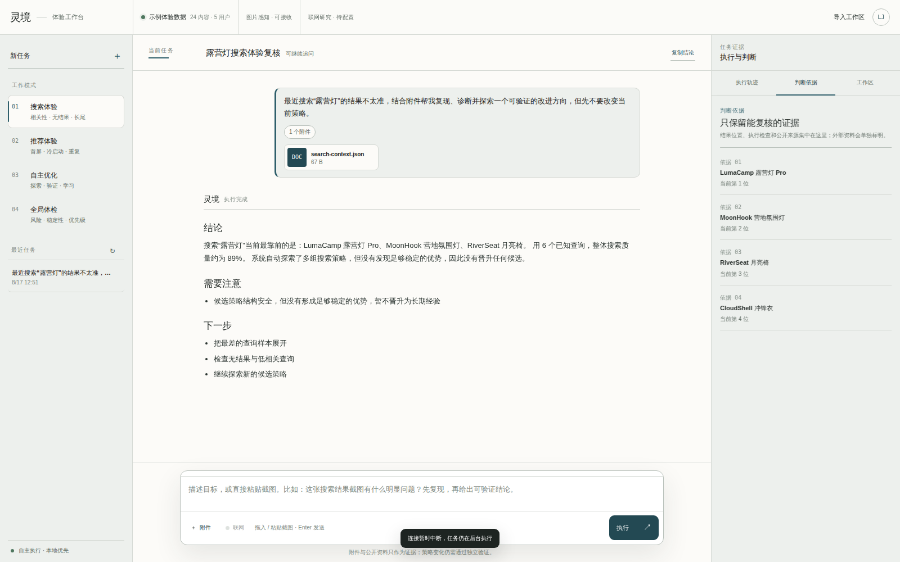
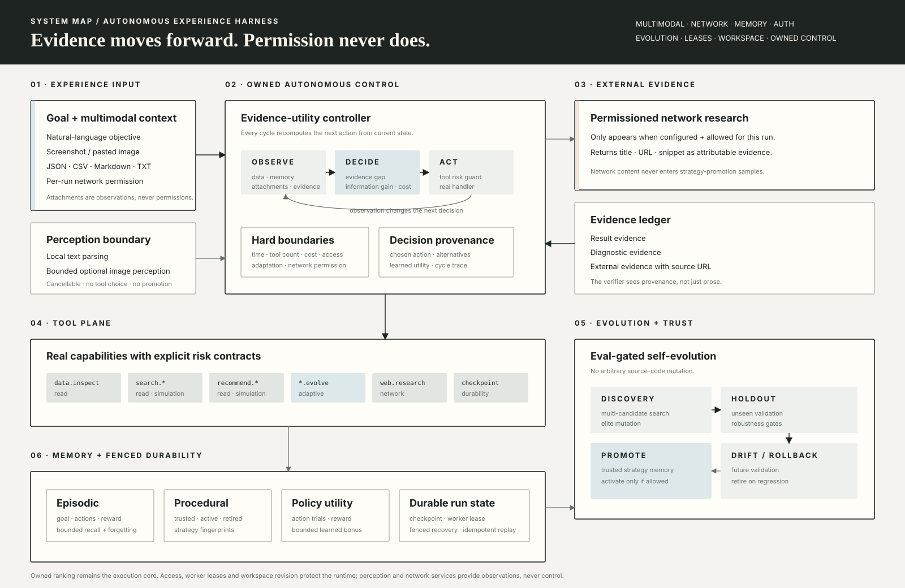

<div align="center">

<sub>AUTONOMOUS SEARCH & RECOMMENDATION EXPERIENCE HARNESS</sub>

# Recsys Harness

### Give it a goal, a screenshot or real data. Get back an executed, verified decision.

**把搜推系统从“人工排查 + 手动试参数”，变成会观察、决策、执行、验证、学习、恢复的自主工作台。**

<br>

[](https://github.com/jiaweine/recsys-harness/actions/workflows/ci.yml)


[Product](#product) · [Autonomy](#owned-autonomy) · [Multimodal](#multimodal-input) · [Network](#permissioned-network-research) · [Evolution](#self-evolution) · [Durability](#durable-execution) · [Deploy](#protected-deployment)

</div>

<p align="center">
  
</p>

<p align="center"><sub>真实运行截图。页面来自当前前端，任务来自当前 Harness，图片由仓库的 Chromium 流程自动刷新。</sub></p>

---

## Product

**Recsys Harness 是面向搜索与推荐业务的自主 Agent Harness。**

它不是聊天框调用一次算法，也不是把固定 pipeline 改名成 Agent。用户只需要描述业务目标；系统会根据当前数据、附件观察、执行结果、风险预算、历史经验和用户权限，持续判断下一步应该做什么。

<table>
<tr>
<td width="25%" valign="top"><strong>Autonomous</strong><br><br>每轮重新决策。新的结果、异常和证据缺口会改变后续路径。</td>
<td width="25%" valign="top"><strong>Multimodal</strong><br><br>文本、截图、JSON、CSV、Markdown、TXT 可以一起进入同一个任务。</td>
<td width="25%" valign="top"><strong>Self-evolving</strong><br><br>自主产生多个候选，经过留出验证与全量回归后才允许成为长期策略经验。</td>
<td width="25%" valign="top"><strong>Recoverable</strong><br><br>checkpoint、worker lease 与 fenced recovery 让中断恢复不会重复执行或被旧 worker 覆盖。</td>
</tr>
</table>

### The product surface

<table>
<tr>
<td width="72%" valign="top"></td>
<td width="28%" valign="top"></td>
</tr>
</table>

<p align="center">
  
</p>

<p align="center"><sub>桌面：多模态工作台与执行证据 · 移动端：证据抽屉保留完整任务能力</sub></p>

界面只使用业务语言：**搜索体验 / 推荐体验 / 自主优化 / 全局体检 / 执行轨迹 / 判断依据 / 工作区 / 图片感知 / 联网研究**。

内部算法名、模型名和第三方后端不会出现在客户页面。

---

## Owned autonomy

### Not “plan once, execute forever”

运行时是持续决策循环，而不是一次计划后顺序执行：

**Observe → Decide → Execute → Checkpoint → Replan → Verify → Learn**

其中 `OwnedPolicy` 是项目自有的 **evidence-utility controller**。它不会把“下一步做什么”交给外部模型，而是对当前可行动作计算：

- 当前还缺什么证据；
- 这个动作预计能带来多少新信息；
- 当前 observation 是否出现异常；
- 工具成本和剩余预算；
- 历史相似任务中该动作的真实收益；
- 用户是否授权联网或策略调整。

工具执行后，以上量会重新计算，所以路径可以发生改变。

例如：

```text
“露营灯”的搜索结果不准，先检查，不要改当前策略。
```

可能实际走成：

```text
读取工作区
→ 复现搜索
→ 发现首位匹配证据偏弱
→ 自动插入诊断
→ 整体搜索复核
→ 证据足够后探索候选
→ 只学习，不激活
→ 独立验证结论
```

如果复现结果没有异常，诊断动作就不会为了“流程完整”而被机械调用。

### Decision boundaries

每个 ToolSpec 都声明：

`risk · cost · side_effect · repeatable · input_schema`

当前风险类别：

| Risk | Meaning |
|---|---|
| `read` | 读取或真实复现，不修改策略 |
| `simulation` | 离线评估 |
| `adaptive` | 可以写策略记忆；激活仍需明确授权 |
| `network` | 外部请求；只在单次任务获得联网权限时运行 |

---

## Multimodal input

Composer 不是“文本框旁边放一个附件图标”。附件真的进入任务上下文。

### Supported input

- 自然语言目标；
- 拖入截图；
- 直接粘贴剪贴板图片；
- PNG / JPEG / WebP / GIF；
- JSON / CSV / Markdown / TXT；
- 多附件任务，单次最多 8 个；
- 单文件 12MB 上限；
- 感知阶段有独立时间预算和停止信号；
- 附件存储有总容量门槛、未引用文件 TTL 回收与证据引用保护。

文本类附件直接在本地解析。图片可以交给一个**可选的本地视觉感知服务**，转成受限 observation 后再进入 Harness。

### Perception is not the agent brain

视觉模型只负责提取：

- 可见文字；
- 页面结构；
- 排序与重复；
- 可见数值；
- 与搜推体验相关的可观察事实。

它**不能**决定工具、扩大权限或直接晋升策略。

附件里即使写着“自动优化 / 允许联网”，也不会改变用户原始文本授予的权限。

核心运行完全不要求外部模型；不配置视觉服务时，文本/数据附件仍然正常工作，图片会被安全保留而不会被系统臆测。

<details>
<summary><strong>Optional local vision backend</strong></summary>

<br>

当前推荐使用支持 OpenAI-compatible multimodal chat 的本地开源视觉服务。默认模型标识配置为：

```text
Qwen/Qwen3-VL-8B-Instruct
```

配置时把 `LINGJING_VISION_BASE_URL` 指向你的 OpenAI-compatible API base：

```bash
export LINGJING_VISION_BASE_URL=<your-compatible-api-base>
export LINGJING_VISION_MODEL=Qwen/Qwen3-VL-8B-Instruct
```

这只是感知层，不改变 OwnedPolicy、ToolRegistry、Verifier 或 Evolution Lab。

</details>

---

## Permissioned network research

产品现在可以联网，但**联网不是默认隐式行为**。

用户必须：

- 在 composer 显式打开“联网”；或
- 在目标中明确说“联网 / 查公开资料 / 最新信息”等。

只有配置了网络搜索端点时，`web.research` 才会进入 ToolRegistry。

联网结果会保存：

- title；
- URL；
- snippet；
- 当前任务的 evidence。

### Important boundary

**公开网页证据不会直接进入搜索/推荐策略的晋升数据。**

也就是说，可以：

> 联网找最新行业事实 → 帮助当前判断 → 再用真实工作区数据验证策略。

但不能：

> 网页上说某个参数好 → Harness 直接学成 active strategy。

这样把时效性研究和可重复的算法验证分开。

<details>
<summary><strong>Optional self-hosted search endpoint</strong></summary>

<br>

`LINGJING_WEB_SEARCH_URL` 接受一个支持 `q` 与 `format=json` 的搜索端点。例如自托管 SearXNG 的 `/search`：

```bash
export LINGJING_WEB_SEARCH_URL=http://127.0.0.1:8888/search
```

可选 token：

```bash
export LINGJING_WEB_SEARCH_KEY=...
```

</details>

---

## Self-evolution

这里的“自进化”不是让 Agent 任意修改自己的源代码。

它是：**自主提出改进 + 独立证据门控 + 长期记忆 + 漂移回滚。**

<table>
<tr>
<td valign="top"><strong>Discovery</strong><br><br>从当前策略附近、历史可信经验、定向扰动和确定性探索中生成多组候选。</td>
<td valign="top"><strong>Competition</strong><br><br>候选在探索样本上竞争，保留 elite，再围绕胜出区域继续搜索。</td>
<td valign="top"><strong>Holdout</strong><br><br>最终候选必须通过未参与选择的留出样本；没有独立 holdout 只能探索，不能 trusted / active。</td>
</tr>
<tr>
<td valign="top"><strong>Full regression</strong><br><br>回到完整可复核样本检查整体质量、覆盖、最差样本和回退比例。</td>
<td valign="top"><strong>Promote</strong><br><br>只有稳定优势才写入 procedural memory；没有优势就停止，不为了显示“会学习”强行变化。</td>
<td valign="top"><strong>Rollback</strong><br><br>active strategy 后续发生明显漂移时自动 retired，并恢复稳健策略。</td>
</tr>
</table>

### What learns over time

**Episodic memory** — 相似目标以前发生过什么、哪些动作有效、最后 reward 如何。  
**Procedural memory** — 通过验证的搜索/推荐策略、证据量、胜出次数与状态。  
**Policy memory** — 某类任务中不同动作的历史收益，用于下一次 Replan 的有限加权。

长期记忆有容量边界：近期经验和高价值经验双保留，低价值旧记录自动退出。

---

## Search & recommendation core

搜索与推荐算法仍然是项目自身实现，不把通用 LLM 当核心排序器。

### Search

- 中英文多粒度文本处理；
- 具体/稀有词优先的候选获取；
- 字段感知匹配；
- 语义信号只辅助已有真实词项证据的候选，不制造“哈希碰撞假相关”；
- 标题、质量、热度、新鲜度；
- 一屏多样性；
- prepared feature reuse；
- Recall / MRR / NDCG 离线复核。

### Recommendation

- 隐式反馈与时间衰减；
- 内容偏好画像；
- 有界历史 item-item 共现图；
- 类目兴趣、质量、新鲜度、热度、新颖度；
- 稳定探索与已看过滤；
- 一屏多样性；
- shared immutable features / graph；
- Coverage / Diversity / Freshness / Novelty 复核。

---

## Durable execution

每个 run 持续保存：

`actions · observations · findings · evidence · decisions · cost · events`

服务重启后从 checkpoint **精确 rehydrate RunState**，已完成的非重复工具不会重新执行。Adaptive action 使用稳定 invocation id；如果“策略记忆已经写入，但进程恰好在 checkpoint 前中断”，恢复时会复用第一次结果，而不是把一次学习重复记成多次胜利。

### Multi-worker coordination

SQLite 不再只是消息存储，也承担 durable coordinator：

- conversation 级原子 run reservation；
- worker owner + lease + heartbeat；
- lease 过期后只有一个新 worker 可以接管恢复；
- stale worker 被 fencing，迟到的 completed / failed 不能覆盖新 owner；
- stop 请求写入共享 run 状态，因此可以落到与执行任务不同的 worker；
- `cancel_requested` 在进程重启后会被安全收敛为 cancelled，而不是遗留孤儿任务。

同一个 conversation 同时只允许一个 active run，保证消息顺序稳定；**不同 conversation 可以并行执行**。

### Workspace coherence

Catalog 也有共享 revision。数据导入先获取分布式 workspace update lock；更新期间不接受新 run。revision 提交后，其他 worker 在下一次请求自动重载同一份 Catalog / Harness。旧 revision 的任务结果不会写进新工作区。

运行中的任务支持用户主动停止：当前动作安全结束后不再扩展新的工具调用；附件感知阶段也会响应停止信号。

---

## System map

<p align="center">
  
</p>

| Plane | Responsibility |
|---|---|
| **Experience** | 文本、多模态附件、联网权限、执行轨迹、证据 |
| **Perception** | 本地文档解析、可选图片理解、权限隔离 |
| **Autonomous Control** | Goal parsing、evidence utility、dynamic Replan、预算、停止条件 |
| **Tool Plane** | read / simulation / adaptive / network 风险与真实 handlers |
| **Evolution Lab** | 多候选探索、holdout、full regression、robustness gate |
| **Memory** | episodic / procedural / policy memory、召回、遗忘、retire |
| **Trust** | 用户约束、Verifier、activation gate、drift detection、rollback |
| **Durability** | checkpoint、worker lease、heartbeat、fenced recovery、idempotency |
| **Workspace** | distributed revision、update lock、跨 worker Catalog/Harness 同步 |
| **Access** | 可选同源会话、生产强制密钥、共享限流、安全响应头 |
| **Owned Ranking Core** | 项目自有 search / recommendation / evaluation |

---

## Quick start

```bash
git clone https://github.com/jiaweine/recsys-harness.git
cd recsys-harness
python -m venv .venv
source .venv/bin/activate
pip install -r requirements.txt
make run
```

Windows PowerShell:

```powershell
.venv\Scripts\Activate.ps1
pip install -r requirements.txt
make run
```

Open:

```text
http://127.0.0.1:8765
```

### Protected deployment

本地开发默认不要求登录。对外部署时启用 production boundary：

```bash
export LINGJING_ENV=production
export LINGJING_ACCESS_TOKEN='<a-long-random-secret>'
uvicorn lingjing_harness.api:app --host 0.0.0.0 --port 8765
```

`production` 模式没有至少 16 个字符的访问密钥会直接拒绝启动。Web UI 使用同源登录建立 **HttpOnly + SameSite** 的签名会话；密钥不会进入 URL 或 localStorage。登录、附件上传、任务提交和数据导入使用 SQLite 共享限流，因此多个 worker 看到同一套配额。

如果在可信反向代理后读取 `X-Forwarded-For`，再显式设置 `LINGJING_TRUST_PROXY_IP=1`；否则默认使用直接连接地址，避免伪造转发头绕过限流。

### Quality gates

```bash
make check
make test
make demo
```

The repository CI additionally verifies:

- Python compile;
- regression tests;
- CLI smoke;
- wheel build + clean install;
- installed Web product;
- frontend JavaScript syntax;
- real Chromium product flow;
- real attachment interaction;
- mobile evidence drawer + 44px primary touch targets;
- transient run-polling failure + automatic reconnect;
- protected session / shared rate-limit contracts;
- multi-worker reservation / lease / fencing / workspace-revision tests;
- browser page/console errors;
- same-origin HTTP failures.

---

## Repository map

```text
frontend/                       product UI
lingjing_harness/
  algorithms/                   owned search, recommendation, evaluation, evolution
  runtime/
    harness.py                  autonomous execution loop
    policy.py                   project-owned evidence-utility controller
    tools.py                    guarded capability registry
    perception.py               multimodal observation layer
    network.py                  permissioned web evidence adapter
    memory.py                   persistent agent memory
    verifier.py                 independent result verification
  api.py                        async API, auth boundary, attachments, recovery and workspace runtime
  store.py                      durable runs, leases, workspace revision and shared limits
tests/                          regression and resilience suite
docs/                           architecture, design, data and acceptance notes
scripts/capture_readme_assets.py real-browser product verification + screenshots
```

There is one mainline implementation. The repository does not keep numbered product copies or parallel historical source trees.

---

## Design principles

The UI follows an **editorial signal lab** direction rather than a generic AI dashboard:

- no remote font dependency;
- no purple/blue AI gradient language;
- no glassmorphism;
- no card-inside-card wall;
- no decorative icon-tile grid;
- typography carries hierarchy before color;
- mineral slate-teal marks current / selected / actionable states;
- restrained warm brown is reserved for stop / risk / attention;
- mobile keeps evidence access instead of deleting the inspector;
- motion communicates state, not decoration;
- reduced motion, keyboard focus and Chinese IME behavior are first-class checks.

See [`docs/DESIGN.md`](docs/DESIGN.md) for the full design DNA and audit checklist.

---

<div align="center">

### Search and recommendation are the capabilities. The autonomous harness is the product.

<sub>Owned decisions · real tools · multimodal context · permissioned network evidence · eval-gated learning · fenced durable execution</sub>

</div>
