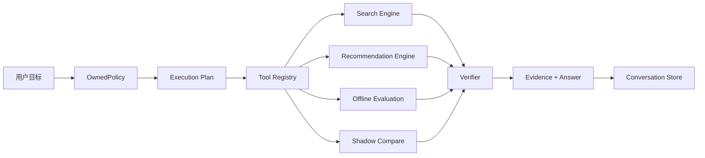

# Architecture

## 产品定义

这是一个**搜推领域垂直 Agent Harness**。通用 harness 负责“如何持续地理解目标、使用工具、记录状态、验证结果”；本项目把工具域替换成搜索与推荐，并把核心决策权留在项目自研算法中。

## 运行时

### 1. OwnedPolicy

`runtime/policy.py` 不依赖 LLM，用项目自有规则和工作区状态完成：

- 识别搜索 / 推荐 / 双路径 / 全局体检；
- 提取查询与用户；
- 判断是否需要候选方案比较；
- 生成实际工具步骤。

未来可以增加学习型 planner，但 tool contract 不变。

### 2. Tool Registry

每个工具都有：

- 名称；
- 描述；
- 风险级别；
- 真实 handler。

当前只有 `read` 与 `simulation`。没有任何会直接写线上排序策略的工具，因此第一版不会出现“Agent 误操作直接改线上”的风险。

### 3. Search Engine

由以下部分组成：

- 多粒度中英文 tokenize；
- 字段感知词项匹配；
- 稳定哈希语义向量；
- 质量 / 新鲜度 / 热度软约束；
- slate 多样性重排。

哈希表征的优势是零外部模型依赖、确定性、可回放；后续可以替换成自训 embedding，而上层 harness 不需要改。

### 4. Recommendation Engine

核心信号：

- 隐式反馈 + 时间衰减；
- 内容语义用户画像；
- 用户历史产生的 item-item 共现图；
- 类目兴趣；
- 质量、新鲜度、热门度、新颖度；
- 稳定探索；
- slate 去同质化。

### 5. Offline Evaluation

搜索：Recall / MRR / NDCG。

推荐：Catalog Coverage / Diversity / Freshness / Novelty，并汇总成内部质量分。

这些指标仅用于工程层；客户 UI 不展示算法名。

### 6. Shadow Compare

候选配置从不直接覆盖当前 engine。流程是：

1. 构造候选 engine；
2. 在同一数据集上评估；
3. 计算 delta；
4. 通过安全门槛后，才标记为 `safe_to_try`。

第一版没有“自动上线”工具。

### 7. Verifier

Verifier 当前拦截：

- 空结果；
- 重复结果；
- 缺失标题；
- 候选方案质量 / 覆盖回退。

用户答案只由执行后的 result 生成。

## 为什么这是 Harness 而不是一个算法 Demo

一个算法 Demo 通常只有 `query -> ranked list`。这里额外有：

- 对话 Session；
- Goal planning；
- Tool contracts；
- Runtime event trace；
- 风险级别；
- 影子候选；
- Verifier；
- 持久化；
- 客户工作台；
- 可继续追问。

这些才是“对话式执行产品”的关键。
